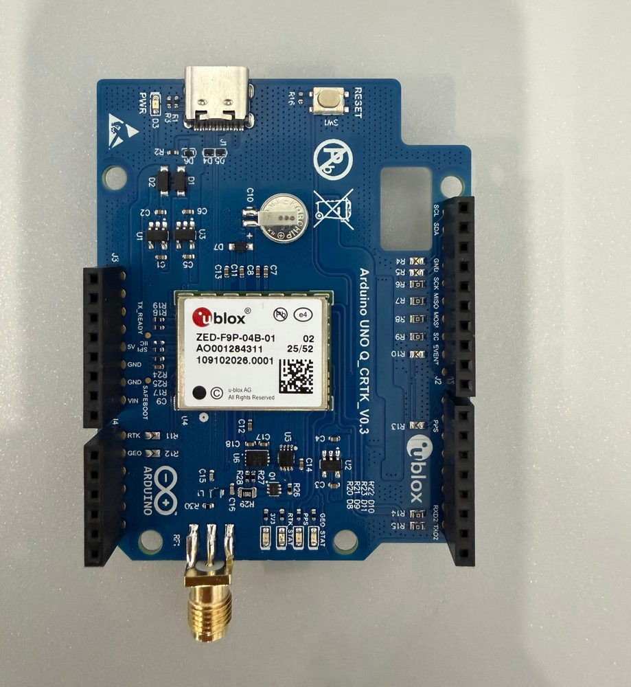
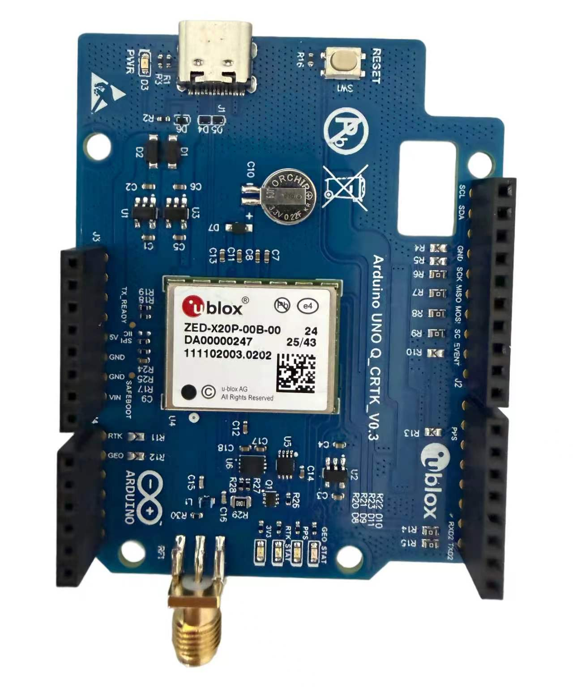
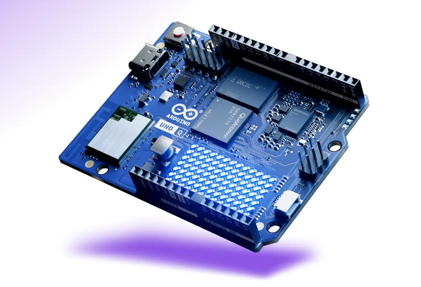
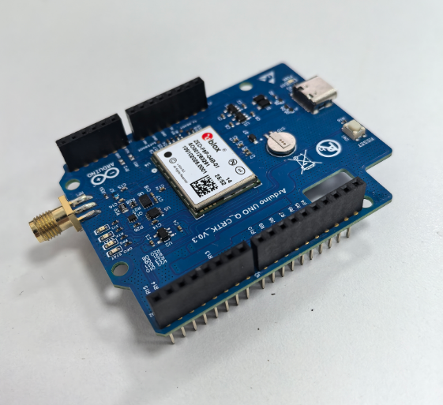
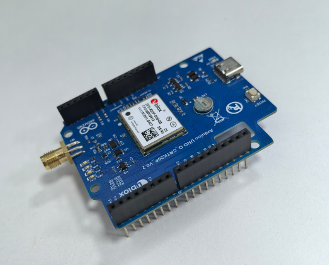

# MJK Ublox GPS Board

An RTK high-precision positioning application for the Arduino UNO Q. It supports two
GNSS modules, both taking PointPerfect corrections over NTRIP: the all-band
**u-blox ZED-X20P** and the dual-band **u-blox ZED-F9P**. Enter your PointPerfect
credentials in a web page and it runs. The configuration is stored on the board and can
be changed at any time without reflashing the firmware.

| MJK Ublox F9P | MJK Ublox X20P |
|---|---|
|  |  |

---

## 1. Installation

### Requirements

- Arduino UNO Q with **Arduino Zephyr Core 0.55.0 or later** flashed
- One of the supported GNSS modules, with its UART wired to UNO Q **D0/D1** and a
  common ground:
  - **u-blox ZED-X20P** (all-band)
  - **u-blox ZED-F9P** (dual-band)
- An active multi-band antenna (e.g. ANN-MB2-00) with a proper ground plane
- The board connected to Wi-Fi

| Arduino UNO Q | MJK Ublox F9P | MJK Ublox X20P |
|---|---|---|
|  |  |  |

The module plugs onto the UNO Q headers; its UART is wired to **D0/D1**.

### Supported GNSS modules

Both modules run the same application against the same PointPerfect SPARTN stream - no
code change and no different mountpoint. What differs is behaviour:

| | ZED-X20P | ZED-F9P |
|---|---|---|
| Bands | All-band (L1/L2/L5/L6) | Dual-band (L1/L2) |
| Time to first RTK fixed | Shorter | Longer - it needs more epochs to resolve ambiguities |
| HDOP while converging | Usually low | Can read 3-4 during acquisition, then settles near 1 |
| GPS L5 corrections | Not used by default under PointPerfect Flex - see **UBX-21038688** | Not applicable |

If the F9P sits in `RTK-FLOAT` for a long time, check two things first: the firmware is
**HPG 1.32 or later** (SPARTN 2.x requires it), and `CFG-SPARTN-USE_SOURCE` is set to
**IP** rather than L-band - otherwise SPARTN arriving over the UART is ignored.

### Steps

1. Download the latest `.zip` from this repository's Releases
2. Open **Arduino App Lab** → **Create new app** on the start screen → **Import App**
3. Select the zip and wait for the app to appear in the list
4. Press **Run**
5. Open `http://<board-ip>:7000/` in a browser

---

## 2. Configuration

### 2.1 Get your PointPerfect credentials

1. Register at the [PointPerfect sign-up page](https://portal.thingstream.io/register)
   (u-blox serves business customers only; a 30-day trial is available)
2. Sign in and go to **Services → Thing List → Add Thing**
   - Any name will do
   - **The correction format must be SPARTN.** It cannot be changed after creation
3. Open the Thing and switch to the **Credentials** tab
4. Copy the server address, port, mountpoint, username and password into the configuration page

### 2.2 Fill in the configuration

Enter the credentials from the previous step at `http://<board-ip>:7000/` and press
**Save & apply**.

| Field | Description |
|---|---|
| NTRIP server | Copy from the Credentials tab |
| Port | Usually `2101` |
| Mountpoint | Usually `NEAR-SPARTN`, and it must match the Thing's SPARTN format |
| Username / Password | Copy from the Credentials tab |
| Bootstrap latitude / longitude | Temporary coordinates reported before a fix is available. Set them to where the device is actually deployed |
| GGA interval | How often the position is reported. Default 5 s. **Do not exceed 30 s** |

After saving, the status should move from `Connected` through `RTK-FLOAT` and settle at
**`RTK fixed`** (centimetre level).

---

## 3. Interface

| Section | Contents |
|---|---|
| Header | Current fix quality: No fix / SPS / DGPS / RTK-FLOAT / RTK fixed |
| Position | Latitude, longitude, altitude, satellites, HDOP, fix age |
| Correction link | Connection state, server, bytes received, rate, GGA count, reconnects, error message |
| Configuration | Credentials and parameters, plus the PointPerfect sign-up link |
| Run log | Expand to see the most recent 100 log entries |

Banners appear at the top of the page for the states that need attention (incomplete
configuration, no data from the module, connected but no data, and so on).

---

## 4. Troubleshooting

| Symptom | What to do |
|---|---|
| No data from the GNSS module | Check the D0/D1 wiring and the common ground; confirm the MCU firmware is flashed |
| Stuck at "No fix" | An **active** antenna is required, with a proper ground plane. Move to open sky |
| "Wrong username or password" | Copy the credentials again from the Thingstream Credentials tab |
| "Mountpoint does not exist" | Make sure the mountpoint matches the Thing's format - a SPARTN Thing needs `NEAR-SPARTN` |
| Connected but no data | Check the bootstrap coordinates; try a different mountpoint |
| X20P stops at RTK-FLOAT and will not converge | See u-blox application note **UBX-21038688** (under PointPerfect Flex the X20P does not use GPS L5 by default) |
| F9P stays in RTK-FLOAT for a long time | Expected while converging - it takes longer than the X20P. If it never fixes, check the firmware is **HPG 1.32 or later** and `CFG-SPARTN-USE_SOURCE` is **IP** |
| F9P reports a high HDOP (3-4) right after power-on | Normal during acquisition; it settles to about 1 once all satellites are locked |
| Configuration is lost after a restart | A yellow banner will be showing; usually a directory permission problem |
| "Lost contact with the board" | Check the board's power and network, then reload the page |

---

## 5. Important notes

1. **The configuration page has no authentication.** Anyone on the same local network can
   read the username and change the configuration. **Use it on a trusted network only.**
2. **Credentials are stored in plain text** in `config.json` on the board, and that file
   **is bundled into the zip produced by App Lab's export feature**.
3. **Before sharing or publishing, clear the credentials:**
   - Open the configuration page, tick **Clear saved password**, press **Save & apply**
   - Confirm there is no `config.json` in the application directory, or that it holds no real credentials
   - Never commit a `.zip` containing credentials to a public repository
4. **A single credential may only have one NTRIP client connected.** A second connection
   disconnects the first.
5. **Do not set the GGA interval above 30 seconds**, or the server will drop the connection.
6. After a significant configuration change the connection takes a few seconds to
   re-establish. This is normal.

---

## 6. Files

| File | Purpose |
|---|---|
| `app.yaml` | App Lab manifest: name, icon, ports, bricks used |
| `sketch/sketch.ino` | MCU firmware: writes correction data to the GNSS module, reports NMEA back |
| `sketch/sketch.yaml` | Zephyr platform configuration |
| `python/main.py` | Linux-side main program: NTRIP connection, configuration, web API |
| `assets/index.html` | Configuration and status page |

---

## Licence

MIT, see [LICENSE](LICENSE).
